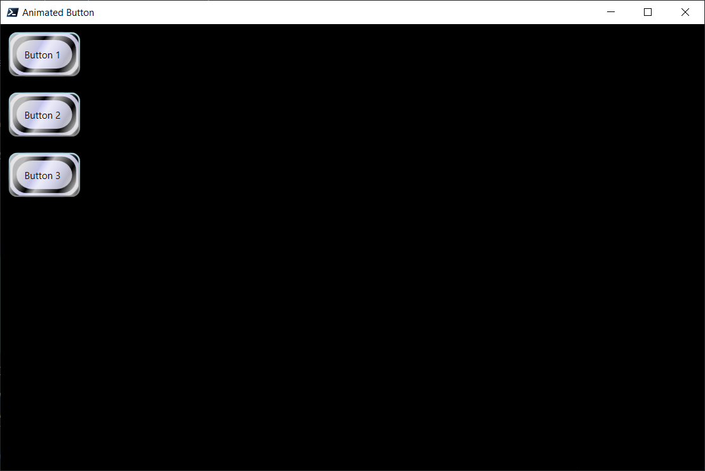

# Animated Button Example

Reimplementation of this [Animated Button walkthrough](https://learn.microsoft.com/en-us/dotnet/desktop/wpf/controls/walkthrough-create-a-button-by-using-xaml).

I'd love to provide a gif of this instead so you can see the animations but unfortunately I can't at the moment.

