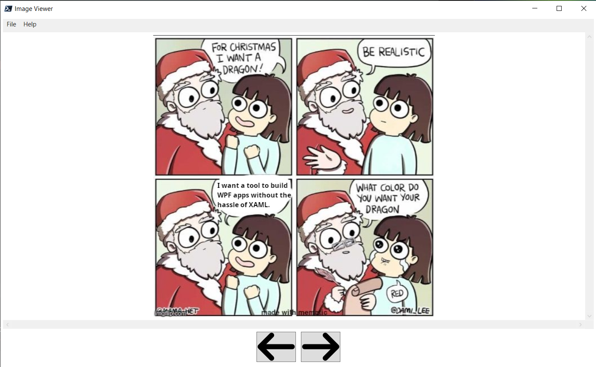

# Image Viewer

Simple image viewer. It sports a menu bar and when you choose File->Open, you can select an image to load into the viewer. Using the directory of the image, a linked list is created and forward/back buttons at the bottom of the window can be used to switch to the previous or next image. Because it uses a linked list the application will loop around from front to back and vice versa when it reaches either end of the list.

Free SVG icons sourced from [FontAwesome](https://fontawesome.com).

