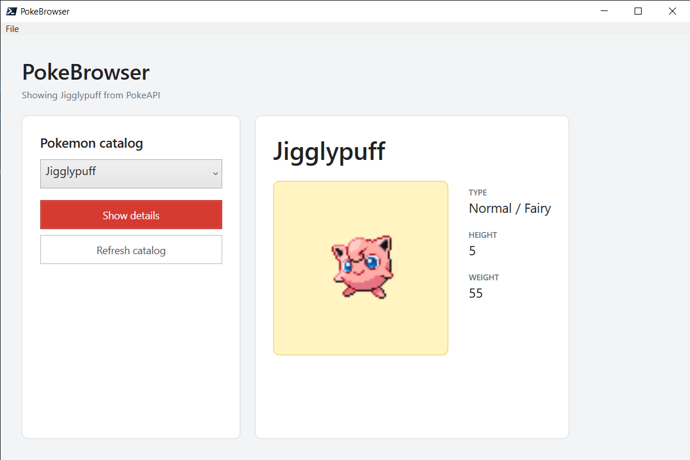

# PokeBrowser

A DSL re-implementation of [Jakub Jareš'](https://github.com/nohwnd) [PokeBrowser](https://github.com/nohwnd/WpfToolkit/tree/master/demo/PokeBrowser.Ps).

## Credit

All credit and thanks for the idea and overall implementation of the [PokeBrowser](https://github.com/nohwnd/WpfToolkit/tree/master/demo/PokeBrowser.Ps) goes to [Jakub Jareš](https://github.com/nohwnd), perhaps best known as the creator of [Pester](https://github.com/pester/Pester). It featured in his 2019 presentation for PSConferenceEU called [Jakub Jareš - A better way to do WPF in PowerShell 5+](https://youtu.be/KW5Wf72Zvug?si=uFk7z0es_iV2pRrP&t=483) in which he demonstrated how Powershell classes could be bound to WPF XAML definitions. Jakub was kind enough to release the code as MIT for public benefit.

Additionally, I should also thank the creators of [PokeApi](https://github.com/pokeapi/pokeapi) for hosting the service that powers this application.

## Interface

Jigglypuff, objectively the best pokemon.



## Architecture

- `PokeBrowser.Models.psm1` defines ordinary PowerShell domain models.
- `State` remains the observable view-model and inherited `DataContext`.
- `PokemonList`, `SelectedPokemon`, `Detail`, loading state, and status text live in `State`.
- `PokemonSummary` and `PokemonDetail` instances live beneath `State` as domain data.
- Controls use `BindProperty`; no XAML markup extensions or third-party assemblies are required.
- Network access is isolated in `Get-PokeBrowserCatalog` and `Get-PokeBrowserDetail`.

## Network Access

The example retrieves its catalog and detail records from [PokeAPI](https://pokeapi.co/) with `Invoke-RestMethod`. The initial catalog request occurs after the window loads, and the refresh and detail commands report request failures through `StatusText`.

Tests mock `Invoke-RestMethod`, so running the PokeBrowser test file does not make network requests.

## Run

```powershell
./PokeBrowser.DSL.ps1
```

## Todo

* Remove "Show Details" button. Just load the pokemon automatically when the user makes a selection.
