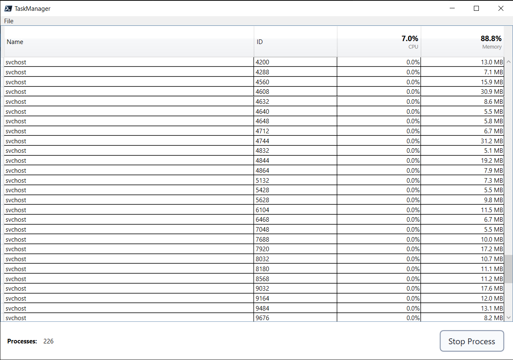

# TaskManager

Basic Task Manager application inspired by the Windows native version.

Definitely still rough around the edges, lacks a lot of niceties but is serviceable.

## Features

* Lists all processes in a datagrid with column sorting.
* Refreshes CPU and memory usage automatically.
* Calculates total CPU and memory usage in the headers for those columns.
* Supports stopping tasks and disables the Stop Process button until a process is selected.

## Memory Header Nuance

The Memory column displays per-process working set values in MB.
The Memory header total shows overall physical memory usage percent based on OS-level values (`TotalVisibleMemorySize` and `FreePhysicalMemory`).
This avoids overcounting shared pages that can happen when summing process `WorkingSet64` values across all processes.
During timed refresh, these OS memory values are sampled in the background work phase and applied on completion to reduce UI-thread blocking.

## TODO

* Headers are a bit on the large side.
* Ensure stopped processes are removed from the list without needing to call resort logic.
* Add filtering capability
* Add "Options" menu item and sub items
    * Always on Top
    * Minimize on Use
    * Hide when minimized
* Add "View" menu item and sub items
    * Refresh Now
    * Update Speed
        * High
        * Normal
        * Low
        * Paused
* Support child process grouping under parent in collapsible control.
