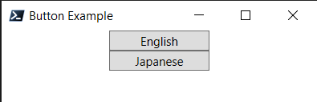

# WPF Powershell

> [!WARNING]
> Work in progress. Nothing is guaranteed to work as intended.

## Table of Contents
* [Overview](#overview)
* [Example](#example)
* [How It Works](#how-it-works)
* [Why?](#why)
* [Project Goals](#project-goals)
* [Autocomplete](#autocomplete)
  * [Intellisense](#intellisense)
  * [VSCode Snippets](#vscode-snippets)
* [Todo](#todo)
* [Notes](#notes)
* [Resources](#resources)

## Overview

Experimental internal Domain-Specific Language (DSL) for building WPF applications in Powershell without having to touch XAML. Because everything in the DSL is Powershell code, you have the full power of the language at your fingertips when developing a GUI.

## Example

The code below creates a window with a couple of buttons. Mandatory arguments get passed as regular function parameters while child objects, properties, and event handlers are declared and returned inside scriptblocks to be processed by the parent control.

More examples can be found in the [Examples](./Examples/) directory.

```powershell
Import-Module ./WPF -Force

Window 'Window' {
    $self.Title = 'Button Example'
    $self.Height = 100
    $self.Width = 250

    StackPanel "Buttons" {
        Button "EnglishButton" {
            $self.Content = 'English'
            $self.Width = 100

            Handler "Click" {
                Write-Host "Hello World"
            }
        }
        Button "JapaneseButton" {
            $self.Content = 'Japanese'
            $self.Width = 100

            Handler "Click" {
                Write-Host "Konichiwa Sekai"
            }
        }
    }
} | Show-WPFWindow
```



If you need or want, you can serialize WPF objects by piping them to `Convert-WPFObjectToXaml`. In the case of the example above, you'll get the following output. Of course, you'll still need to wire everything up in C#.

**Output**
```xml
<?xml version="1.0" encoding="utf-16"?>
<Window ThemeMode="None" Title="Button Example" Name="Window" Width="250" Height="100" xmlns="http://schemas.microsoft.com/winfx/2006/xaml/presentation">
  <StackPanel Name="Buttons">
    <Button Name="EnglishButton" Width="100">English</Button>
    <Button Name="JapaneseButton" Width="100">Japanese</Button>
  </StackPanel>
</Window>
```

## How It Works

DSL keywords are just aliases to Powershell functions which programmatically create the WPF object. For example, the keyword `Grid` is an alias for `New-WPFGrid` which returns a [Grid](https://learn.microsoft.com/en-us/dotnet/api/system.windows.controls.stackpanel?view=windowsdesktop-10.0#properties) object. The function parameters typically consist of an initializer such as the name of the object and end with a scriptblock. Powershell [ParameterSets](https://learn.microsoft.com/en-us/powershell/module/microsoft.powershell.core/about/about_parameter_sets?view=powershell-7.5) are used to control the positional parsing of values and so far I've only found use for `Implicit` and `Explicit` sets to make things more obvious. For instance, you can call `Grid 'Name' 4 4 {}` to create a 4x4 grid or `Grid 'Name' {}` to have the layout inferred. Initializer params are typically cosmetic as you can set properties/call code from the the scriptblock. In the case of the `Grid 'Name' 4 4 {}`, the logic for creating and adding the grid definitions is hidden behind the row/column parameters.

From top to bottom, each UI element is created, registered (see [object-references](#object-references)), and each scriptblock is processed by `Update-WPFObject`. An automatic variable called `$self` is injected into the scriptblock which refers to the object we just created and mostly used for property setting. Objects returned by the scriptblock are processed by custom types added as note properties. `Control` types are added as children, `Handler` types are registered with events, and so on. While `Update-WPFObject` does not call itself, it causes recursion by triggering each scriptblock in the tree of nodes.

Grid elements such as `ColumnDefinition` and `RowDefinition` have special handling. Grid definitions are given a custom `Children` note property to which controls can be added. When a Grid receives a `RowDefinition`, it processes the row and its children. If the user did not define the Grid with rows and columns, the definitions will be added automatically. For columns specifically, definitions are added only if a column at that index doesn't exist. For instance, if you add two rows, the first row containing one column and the second row containing two columns, processing of the second row will ignore the first column definition and add the second.

Finally, after all scriptblocks have been executed, the window object is passed to `Show-WPFDialog` which calls the `ShowDialog()` method and `Close()` when the window closes.

## Why?

Many reasons but if I had to name a few big ones:
* WinForms is too limited and WPF demands too much (XAML, Visual Studio, C#, MVVM)
* Declarative syntax is good but I just instinctively hate XAML
* C# requires too much ceremony for my lizard brain
* Because I wanted to see how difficult this would be

## Project Goals

* Make a fun leaky abstraction
* Convention over configuration (WPF is flexible at the expense of usability)
* Easy to read (everything is nested like HTML)
* Simple things should be easy (shouldn't need to be a programmer or need an IDE to make a window with buttons)
* Composibility (keywords are just functions with aliases)
* Lots of examples (if this is actually useful/productive then sample projects should demonstrate that)
* Xaml escape hatch (should be possible to convert objects to their Xaml representation)

## Autocomplete

TLDR: I can't provide real intellisense but I'm working on some basic stuff using VSCode snippets and Powershell's TabExpansion2.

### Intellisense

I'm not the type of person to mess around with VSCode extensions so my only option is to use what is natively provided by Powershell. Unfortunately, it's trickier than it should be because while the `ArgumentCompleterAttribute` passes a `CommandAST` to the scriptblock that AST is limited to the scriptblock. In other words, because `Handler` is defined inside a scriptblock passed to `Button`, we can't access the part of the AST where `Button` is defined simply by travering the `Parent` property of the `CommandAST`.

I've found a workaround that involves accessing the callstack to get invocation args for TabExpansion2. Among those arguments are the full AST and the cursor position. With those, we can search the AST to get the calling node and find the command value (e.g. `Button`) to determine what values should be returned.

### VSCode Snippets

I'm slowly adding VSCode snippets to [wpf.code-snippets](../../../.vscode/wpf.code-snippets) to make scaffolding the DSL easier.

Snippets can be triggered by typing the `wpf-<control name>` or by pressing `Ctrl+Alt+J`.

## Todo

* Error handling is atrocious. Really need a stack trace instead of a long list of chained errors.
* Right now you'll get registration errors if you're recreating an object without unregistering it first or calling `Import-Module ./WPF -Force`. `Show-WPFDialog` isn't the right place to handle this but there has to be a better way.

## Notes

### Object References

Because children are defined by functions and added automatically there is an issue regarding node access. If each element were created the regular way you'd have a variable reference but not here. I'm thinking that perhaps that creating a control automatically creates a variable or stores a reference in a hashtable where the lookup key is the name of the control. If I went the automatic variable route I would need to ensure that whitespace was converted to underscores or hyphens. For the Window, it doesn't have a name property so I would need to add one on creation or use something else.

**(2025-12-24)**

I implemented a control lookup system using some helper functions and a hashtable which seems to work. Users can use the `Reference` keyword to lookup any registered object. I found out afterwards that WPF supports a name lookup system via the `FindName('name')` method. Like my implementation, it only works if the name has been registered. Unlike my implementation, it's a PITA because it requires instancing a `NameScope` and calling `[NameScope]::SetNameScope($NameScope, $Window)` for `RegisterName('name', $object)` to work. Additionally, this seems to fundamentally alter the WPF app, requiring an `Application` instance to call `$App.Run($Window)`. `$Window.ShowDialog()` simply does nothing when a `Namescope` is set and those might be specific to XAML so it's unclear how to properly use them with programmatically created controls.

Attempts to rerun the app now fail with `Cannot create more than one System.Windows.Application instance in the same AppDomain.` even though I've called `$App.Windows.Close()` to close all windows and the app's shutdown mode is set to `OnLastWindowClose`. This may not even be worthwhile as an application doesn't return anything via stdout. Printing to the console using `Write-Host` is possible but returning a string is a no go.

While I generally prefer to use native mechanisms where possible, I'm either incapable of understanding it or it is too inflexible to behave how I want so I'm going to ignore it for now.

### RelayCommand

**(2026-01-06)**

Like Prometheus stealing fire from the gods I have absconded away with the `RelayCommand` implementation from `CommunityToolkit.Mvvm`. I think maybe the `CommandManager` class was the thing that required the `CommandBinding` as assigning the command directly worked fine. I'm not in love with the syntax for the command which is currently `RelayCommand { Execute Code } { Can Execute Code }` because there could be a target and having two scriptblocks like that doesn't really fit with what we've done so far. If only I had contextual commands but that's a lot of effort for a little payoff. This does mean that in theory, you can now grey out a 'Save' menu item until the user makes a change.

**(2025-12-27)**

While attempting to implement a menu bar I learned that, although you can setup a simple handler, there is a special `ICommand` interface used to share logic around. For instance, you might put `CloseWindow()` code here. So you might think that you'd instance a `Command` object, connect it to a `MenuItem` like "Close" and be done. Haha... hahahaha.... ha... okay I'm fine again. No, there isn't a `Command` object, `ICommand` is just an interface, you need to create a class called `RelayCommand` which implements two private methods which `ICommand` defines as `Executed` (for the doing) and `CanExecute` (for the can do, which they cannot by default) call. Not only does `ICommand` and its' target need to be associated with the `MenuItem` but you must also wrap this in a `CommandBinding` instance before adding it to the target `UIElement`.

Alas, as is typical these days, the `RelayCommand` class which underpins the `ICommand` implementation cannot be easily implemented using dotnet core because the `CommandManager` class was dropped and, seemingly, is only available from a third party module `CommunityToolkit.Mvvm`. I learned this while trying to create the `RelayCommand` class in C# and import into Powershell using `Add-Type -TypeDefinition`. Well, even if that module were Microsoft's own I wouldn't use it here anyway. As a final insult, the built-in `ApplicationCommands` don't implement any logic of their own... why...? You know what, don't answer that.

At the end of the day, frustrated with the inflexibility of what must be the most flexible framework ever designed, I'm left with a simple, functional "Click" event handle. The moral of the story is KISS.

```powershell
MenuItem '_Exit' {
    Handler Click {
        $Window = Reference 'Window'
        $Window.Close()
    }
}
```

## Resources

* https://powershellexplained.com/2017-03-04-Powershell-DSL-example-RDCMan/
* https://app.pluralsight.com/library/courses/powershell-guis-building-wpf-free/table-of-contents
